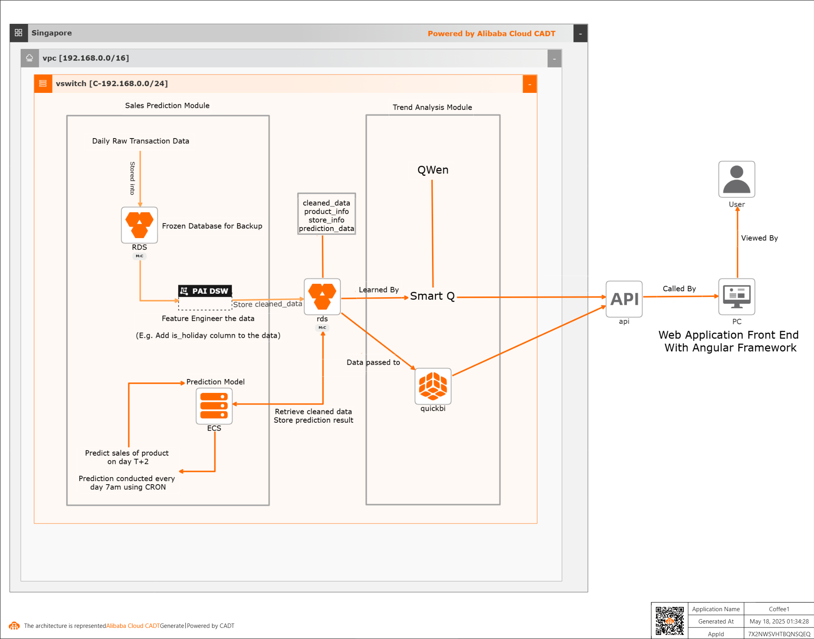

Intelligent F&B Inventory Management: A Game-Changer Powered by Alibaba Cloud
=============================================================================

Running a restaurant is a high-stakes game. One day you're tossing out spoiled ingredients from overstocking, the next you're scrambling because you ran out of chicken mid-rush. Food waste is a global problem, [1/3 of all food produced is lost or wasted –around 1.3 billion tonnes of food –costing the global economy close to $940 billion each year.](http://www.fao.org/food-loss-and-food-waste/en). It hits F&B businesses hard. Enter our intelligent inventory management system, powered by Alibaba Cloud, designed to tackle these headaches with smart predictions, real-time insights, and a unique business model to make it accessible.

Why It's Critical
-----------------

Inventory mismanagement in F&B leads to wasted food, lost revenue, and unhappy customers. Our solution uses Alibaba Cloud's tech to predict sales, optimize stock, and cut waste, saving businesses money while addressing a global issue. Plus, with our Smart Q feature, you get tailored explanations and analysis based on your data, making decisions a breeze.

How It Works
------------

### Frontend: Intuitive and Insightful

Built on Angular.js, the interface is clean and responsive. Alibaba Cloud Quick BI dashboards, paired with Smart Q, deliver real-time stock levels, sales trends, and data-driven explanations. Whether you're checking stock on your phone or analyzing trends on a desktop, it's user-friendly and actionable.

### Backend: The Powerhouse

Alibaba Cloud drives the system:

-   **Data Storage**: ApsaraDB RDS securely stores daily sales and inventory data.
-   **Data Processing**: Platform for AI (PAI) Data Science Workshop (DSW) manages:
    -   Data validation to ensure accuracy.
    -   Feature engineering for predictive models.
    -   Cleaned data storage for quick access.
-   **Compute**: Alibaba Cloud ECS handles predictions, data transformations, and database logging.
-   **Smart Q**: An LLM-powered tool that analyzes your data, explains trends, and answers questions like "Why are we overstocking dairy?" or "What's driving our sales spikes?"

### Prediction Engine

Hosted on ECS, it runs daily morning cron jobs to forecast T+2 day sales based on T-day data. Custom ML models optimize stock levels, while Smart Q provides detailed analysis and recommendations based on your specific data inputs.

Key Features
------------

-   **Sales Trend Visualization**: Quick BI dashboards show what's moving.
-   **Inventory Monitoring**: Real-time stock updates to avoid surprises.
-   **Automated Restocking**: AI-driven order suggestions.
-   **Real-Time Analytics**: Quick BI and Smart Q deliver instant insights and explanations.
-   **Historical Data Analysis**: Identify long-term trends for strategic planning.
-   **Smart Q Analysis**: LLM-powered explanations of your data, answering questions and highlighting opportunities.

Tech Stack
----------



-   **Frontend**: Angular.js for a responsive UI.
-   **Data Visualization & Analysis**: Alibaba Cloud Quick BI and Smart Q for dashboards and LLM-driven insights.
-   **Database**: ApsaraDB RDS for secure data storage.
-   **ML Pipeline**: PAI DSW for predictive modeling.
-   **Compute**: Alibaba Cloud ECS for predictions, transformations, and logging.
-   **Analytics**: Custom ML models and Smart Q for forecasting and data analysis.

Business Model
--------------

Our fixed-rate subscription model tackles the $1 trillion global food waste crisis while delivering value to F&B businesses. Rates reflect real-life savings from reduced waste and optimized inventory, verified by Alibaba Cloud's predictive analytics and Smart Q's LLM-powered analysis. Small cafés pay $99-$149/month, medium restaurants pay $599-$999/month, and large chains pay $1,500-$3,500/month. We expect to serve **500 small, 200 medium, and 50 large businesses in Year 1**, generating **$4.16M** in revenue and **$1.06M** in profit (25.4% margin). Costs include Alibaba Cloud infrastructure ($1.54M), development ($480K), support ($310K), marketing ($675K), and overheads ($100K). With 20% customer growth, revenue grows to **$4.99M (Year 2)** and **$5.99M (Year 3)**, with profits of **$1.75M (35.0%)** and **$2.30M (38.4%)**, respectively. Transparent Quick BI reports ensure trust, aligning costs with financial gains for a scalable, sustainable solution.


## Expected Profit (1st Year)
Revenue ($4,161,600) - Costs ($3,103,700) = Net Profit ($1,057,900)

# Pricing & Business Overview

| **Tier**       | **Business Size**                         | **Revenue Range**   | **Food Costs**      | **Estimated Savings (4-10%)** | **Fixed Monthly Rate** |
|----------------|--------------------------------------------|----------------------|----------------------|-------------------------------|--------------------------|
| **Basic**      | Small (Cafés, Small Restaurants)           | $250K–$1M            | $75K–$300K           | $3,000–$30,000/year           | $99                |
| **Pro**        | Medium (Mid-Sized Restaurants, Small Chains) | $1M–$5M             | $300K–$1.5M          | $30,000–$150,000/year         | $599               |
| **Enterprise** | Large (Chains, Large Restaurants)          | $5M+                | $1.5M+               | $120,000–$300,000/year        | $2,000         |

---

# Features Comparison

| **Feature**                                                                 | **Basic** | **Pro** | **Enterprise** |
|------------------------------------------------------------------------------|:---------:|:-------:|:--------------:|
| Real-time inventory monitoring                                               | ✅        | ✅      | ✅             |
| Basic Quick BI dashboards (sales trends, stock levels)                      | ✅        | ✅      | ✅             |
| Advanced Quick BI dashboards (custom metrics)                               | ❌        | ✅      | ✅             |
| Custom Quick BI dashboards (multi-location support)                         | ❌        | ❌      | ✅             |
| Automated restocking (up to 50 SKUs)                                        | ✅        | ✅      | ✅             |
| Automated restocking (up to 200 SKUs)                                       | ❌        | ✅      | ✅             |
| Automated restocking (unlimited SKUs)                                       | ❌        | ❌      | ✅             |
| Smart Q: Basic LLM queries (e.g., “What’s low in stock?”)                   | ✅        | ✅      | ✅             |
| Smart Q: Advanced LLM analysis (e.g., “Why are we overstocking?”)          | ❌        | ✅      | ✅             |
| Smart Q: Full LLM analysis with predictive insights                         | ❌        | ❌      | ✅             |
| Historical data analysis (1-year lookback)                                  | ✅        | ✅      | ✅             |
| Historical data analysis (3-year lookback)                                  | ❌        | ✅      | ✅             |
| Historical data analysis (5-year lookback)                                  | ❌        | ❌      | ✅             |
| Email support                                                                | ✅        | ✅      | ✅             |
| Priority email + chat support                                               | ❌        | ✅      | ✅             |
| Dedicated account manager + 24/7 support                                    | ❌        | ❌      | ✅             |

---

Why It's a Win
--------------

-   **Tackles Food Waste**: Helps reduce the 1.3 billion tons of global food waste by optimizing stock.
-   **Prevents Shortages**: Ensures you're always ready for demand.
-   **Smarter Decisions**: Quick BI dashboards and Smart Q's data analysis provide clear, actionable insights.
-   **Automation**: Saves time with automated restocking and inventory tracking.
-   **Cost Savings**: Cuts waste and optimizes stock, with our subscription tied to your savings.

Get Started
-----------

1.  **Install Dependencies**:

    ```
    npm install
    ```

2.  **Run the Server**:

    ```
    ng serve
    ```

3.  **Access It**: Visit `http://localhost:4200/`.

Final Take
----------

Food waste is a massive issue, and inventory chaos doesn't help. Powered by Alibaba Cloud, our system combines Quick BI's slick dashboards with Smart Q's LLM-powered analysis to optimize stock, cut waste, and save money. With a subscription model tied to your savings and scaled to your business size, it's a practical solution for any F&B operation. Small bistro or big chain, this is the tool to keep your inventory, and your bottom line in check.